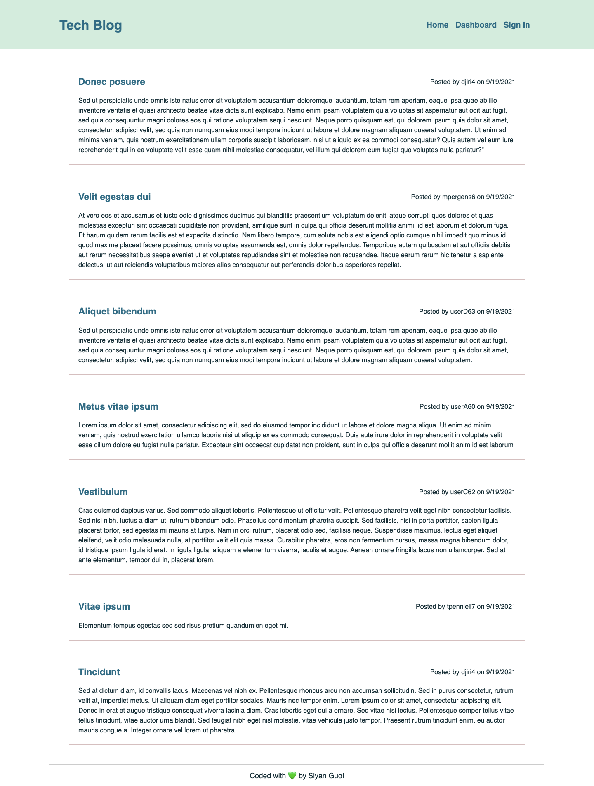
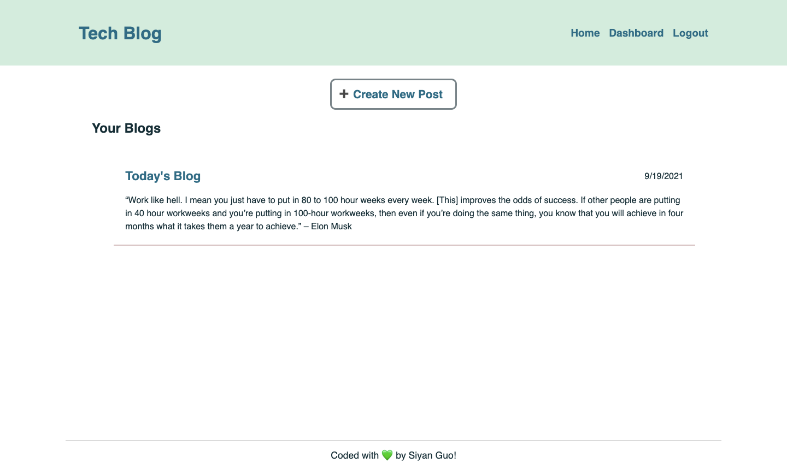
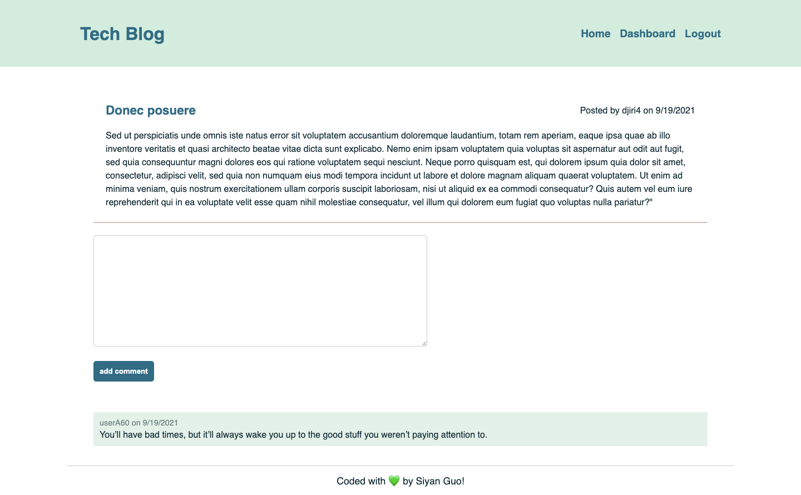

# Tech-Blog

## Description
This is a CMS-style blog site similar to a Wordpress site, where developers can publish their blog posts and comment on other developers’ posts as well. 

This application follows the Model-View-Controller paradigm in its architectural structure. I use the express-handlebars package to use Handlebars.js for the Views, use the MySQL2 and Sequelize packages to connect to a MySQL database for the Models, and create an Express.js API for the Controllers.

It also uses the dotenv package to use environment variables, the bcrypt package to hash passwords, and the express-session and connect-session-sequelize packages to add authentication.

## Built With
* Node.js
* Express.js
* Sequelize
* MySQL2 npm package
* express-session npm package
* Handlebars.js

## Deployed on Heroku

## Contribution
< > with ❤️  by Serena Guo

## Screenshots
Homepage View:

Dashboard View:

Single Post View

